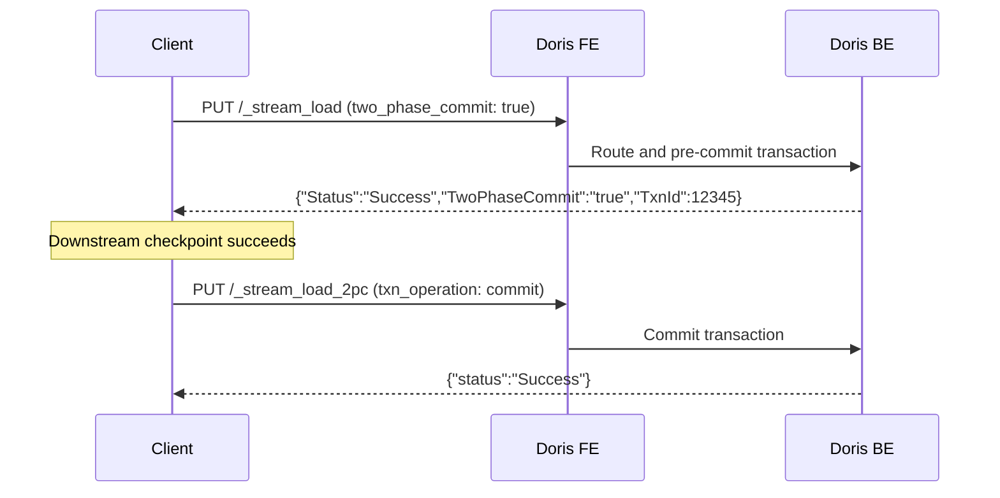

Apache Doris supports multiple ingestion methods that cover real-time streaming, continuous Kafka consumption, large-scale batch loads from object storage, and transactional SQL inserts. Each method maps to a different workload profile — choose based on your latency requirements, data source, and throughput needs.

## Ingestion methods at a glance

| Method | Protocol | Latency | Throughput | Best for |
|--------|----------|---------|------------|----------|
| [Stream Load](/ingestion/stream-load) | HTTP PUT | Seconds | Medium | Real-time ingestion from applications, Flink, or scripts |
| [Routine Load](/ingestion/routine-load) | Pull from Kafka | Seconds | High | Continuous, unattended Kafka stream ingestion |
| [Broker Load](/ingestion/broker-load) | Async pull from HDFS/S3 | Minutes | Very High | Batch ETL from data lakes (Parquet, ORC, CSV) |
| INSERT INTO | MySQL protocol | Seconds | Low–Medium | ETL pipelines, small datasets, interactive queries |
| Group Commit | HTTP / MySQL | Milliseconds | High | High-frequency micro-batches written in tight loops |

## Transactions and the label mechanism

Every load in Doris — regardless of method — runs inside a single transaction. When a load completes, the transaction is either committed (all rows visible atomically) or aborted (no rows written). There are no partial commits.

### Labels and idempotency

Each load job carries a **label**: a user-supplied or auto-generated string that uniquely identifies the job within a database. Labels are the primary mechanism for idempotency.

<Note>
If you submit a load with a label that already exists and succeeded, Doris rejects the new request and returns the result of the original load. This means you can safely retry a load after a network failure without risk of duplicate data — as long as you keep the same label.
</Note>

Labels expire after a configurable retention period (default 3 days, controlled by `label_keep_max_second` in `fe.conf`). After expiry, the same label may be reused.

## Exactly-once with two-phase commit (2PC)

Stream Load supports a **two-phase commit** protocol to achieve exactly-once semantics when coordinating with external systems such as Apache Flink.

The workflow has two phases:

1. **Pre-commit** — send data with `two_phase_commit: true`. Doris validates the data, writes it to BE storage, but does not make it visible. It returns a `TxnId`.
2. **Commit or abort** — once your upstream system confirms the data is durable (for example, a Flink checkpoint completes), send a commit request with the `TxnId`. To roll back, send an abort instead.

This decouples data ingestion from downstream acknowledgement, preventing data loss or duplication across system restarts.

## Choosing the right method

<CardGroup cols={2}>
  <Card title="Stream Load" icon="bolt" href="/ingestion/stream-load">
    Synchronous HTTP PUT. Results returned immediately. Use when your application or pipeline needs to know the outcome of each batch before proceeding.
  </Card>
  <Card title="Routine Load" icon="rotate" href="/ingestion/routine-load">
    Long-running Kafka consumer managed entirely by Doris. Handles partition rebalancing, offset tracking, and automatic retry. Zero client-side orchestration needed.
  </Card>
  <Card title="Broker Load" icon="database" href="/ingestion/broker-load">
    Asynchronous job that reads directly from HDFS, S3, Azure Blob, or GCS. Optimal for terabyte-scale historical backfills and nightly batch loads.
  </Card>
  <Card title="Group Commit" icon="layer-group" href="/ingestion/stream-load#group-commit">
    Accumulates many small writes into a single transaction automatically. Reduces transaction overhead for high-frequency micro-batch workloads without changing the client API.
  </Card>
</CardGroup>
