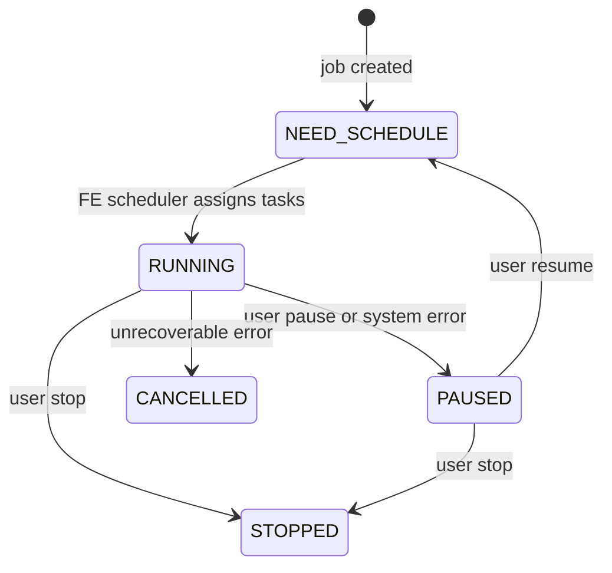

Routine Load is a long-running, pull-based Kafka consumer fully managed by Doris. Once created, a Routine Load job runs indefinitely: it discovers topic partitions, assigns them to Backend nodes, tracks offsets in the FE catalog, and automatically resumes after transient failures. No external orchestration is required.

**Supported formats:** CSV, JSON

Each Routine Load job spawns one or more sub-tasks (each an internal stream load), which are scheduled and executed by BE nodes. Offset commits happen only after the load transaction is committed, providing at-least-once delivery semantics with exactly-once behavior achievable via idempotent writes or unique key deduplication.

The job state machine is implemented in `RoutineLoadJob.java` and `KafkaRoutineLoadJob.java` in the FE core.

## Create a Routine Load job

### CSV format

```sql
CREATE ROUTINE LOAD mydb.my_kafka_job ON mytable
COLUMNS TERMINATED BY ","
PROPERTIES
(
    "max_batch_interval" = "20",
    "max_batch_rows" = "300000",
    "max_batch_size" = "209715200",
    "strict_mode" = "false",
    "format" = "csv"
)
FROM KAFKA
(
    "kafka_broker_list" = "kafka_broker1:9092,kafka_broker2:9092",
    "kafka_topic" = "my_topic",
    "property.group.id" = "doris_consumer_group",
    "property.kafka_default_offsets" = "OFFSET_BEGINNING"
);
```

### JSON format with jsonpaths

Use `jsonpaths` when your Kafka messages are JSON objects and you need to extract specific fields or handle nested structures:

```sql
CREATE ROUTINE LOAD mydb.json_job ON orders
PROPERTIES
(
    "format" = "json",
    "jsonpaths" = "[\"$.order_id\", \"$.amount\", \"$.status\"]",
    "strip_outer_array" = "true",
    "max_batch_interval" = "10",
    "max_batch_rows" = "500000"
)
FROM KAFKA
(
    "kafka_broker_list" = "kafka:9092",
    "kafka_topic" = "orders_topic",
    "kafka_partitions" = "0,1,2,3",
    "kafka_offsets" = "OFFSET_LATEST",
    "property.group.id" = "doris_orders_group"
);
```

<Note>
`strip_outer_array` applies only when each Kafka message is a JSON array such as `[{...}, {...}]`. For single-object messages (`{...}`), leave it unset or `false`.
</Note>

### SASL/SSL authentication

To connect to a secured Kafka cluster, pass standard Kafka client properties with the `property.` prefix:

```sql
CREATE ROUTINE LOAD mydb.secure_job ON events
COLUMNS TERMINATED BY ","
FROM KAFKA
(
    "kafka_broker_list" = "kafka:9093",
    "kafka_topic" = "events_topic",
    "property.group.id" = "doris_secure_group",
    "property.security.protocol" = "SASL_SSL",
    "property.sasl.mechanism" = "PLAIN",
    "property.sasl.username" = "doris_user",
    "property.sasl.password" = "s3cr3t"
);
```

## Monitoring and management

### Check job status

```sql
SHOW ROUTINE LOAD FOR mydb.my_kafka_job\G
```

This returns one row per job with fields including `State`, `CurrentTaskNum`, `JobStatistic`, `Progress` (consumed offset per partition), `Lag`, and `ReasonOfStateChanged`.

To see the currently executing sub-tasks:

```sql
SHOW ROUTINE LOAD TASK WHERE JobName = "my_kafka_job";
```

## Job state machine

A Routine Load job transitions through the following states:



| State | Description |
|-------|-------------|
| `NEED_SCHEDULE` | Job is waiting for the FE scheduler to assign sub-tasks to BE nodes. Initial state after creation or resume. |
| `RUNNING` | Sub-tasks are actively consuming from Kafka and loading into Doris. |
| `PAUSED` | Consumption is stopped. Can be caused by exceeding `max_error_number` or by a manual pause. The job can be resumed. |
| `STOPPED` | Terminal state. The job has been explicitly stopped and cannot be resumed. |
| `CANCELLED` | Terminal state. The job encountered an unrecoverable error (for example, the target table was dropped). |

## Pause, resume, and stop

```sql
-- Pause (consumption stops; offsets are preserved)
PAUSE ROUTINE LOAD FOR mydb.my_kafka_job;

-- Resume (restarts from the last committed offset)
RESUME ROUTINE LOAD FOR mydb.my_kafka_job;

-- Stop (terminal; cannot be resumed)
STOP ROUTINE LOAD FOR mydb.my_kafka_job;
```

<Warning>
`STOP` is irreversible. To restart consumption after a stop, you must create a new Routine Load job. Use `PAUSE` during planned maintenance instead.
</Warning>

## PROPERTIES reference

| Property | Type | Default | Description |
|----------|------|---------|-------------|
| `max_batch_interval` | seconds | `60` | Maximum time each sub-task runs before committing, regardless of row count or size. Source: `DEFAULT_MAX_INTERVAL_SECOND` in `RoutineLoadJob.java:123`. |
| `max_batch_rows` | integer | `20000000` | Maximum rows consumed per sub-task execution. Source: `DEFAULT_MAX_BATCH_ROWS` in `RoutineLoadJob.java:124`. |
| `max_batch_size` | bytes | `1073741824` (1 GB) | Maximum bytes consumed per sub-task execution. Source: `DEFAULT_MAX_BATCH_SIZE` in `RoutineLoadJob.java:125`. |
| `max_error_number` | integer | `0` | Maximum number of error rows allowed over a sliding window of `max_batch_rows * 10` rows. Exceeding this threshold pauses the job. Source: `DEFAULT_MAX_ERROR_NUM` in `RoutineLoadJob.java:120`. |
| `strict_mode` | boolean | `false` | When `true`, type conversion errors cause the row to be rejected rather than coerced. Source: `DEFAULT_STRICT_MODE` in `RoutineLoadJob.java:127`. |
| `timezone` | string | system TZ | Timezone used for functions like `strftime` in column expressions. |
| `format` | string | `csv` | Input format: `csv` or `json`. |
| `jsonpaths` | string | — | JSON array of JSONPath expressions. Required when the JSON field names differ from the table column names or when extracting nested fields. |
| `strip_outer_array` | boolean | `false` | Parse the Kafka message as a JSON array and yield one row per element. |

## Kafka data source properties

| Property | Required | Description |
|----------|----------|-------------|
| `kafka_broker_list` | Yes | Comma-separated list of Kafka broker addresses in `host:port` format. |
| `kafka_topic` | Yes | Name of the Kafka topic to consume. |
| `kafka_partitions` | No | Comma-separated list of partition IDs to consume. Defaults to all partitions in the topic. |
| `kafka_offsets` | No | Starting offsets for each partition in `kafka_partitions`, or a keyword applied to all: `OFFSET_BEGINNING` (consume from earliest), `OFFSET_LATEST` (consume only new messages). |
| `property.group.id` | Recommended | Kafka consumer group ID. Multiple Doris clusters should use distinct group IDs to avoid offset conflicts. |
| `property.security.protocol` | No | Kafka security protocol: `PLAINTEXT`, `SSL`, `SASL_PLAINTEXT`, or `SASL_SSL`. |
| `property.sasl.mechanism` | No | SASL mechanism when using SASL: `PLAIN`, `SCRAM-SHA-256`, `SCRAM-SHA-512`, or `GSSAPI`. |
| `property.kafka_default_offsets` | No | Default starting offset for newly discovered partitions: `OFFSET_BEGINNING` or `OFFSET_LATEST`. |

<Tip>
Any standard Kafka client property (librdkafka configuration key) can be passed with the `property.` prefix. This includes SSL certificate paths, fetch sizes, and timeout settings.
</Tip>
